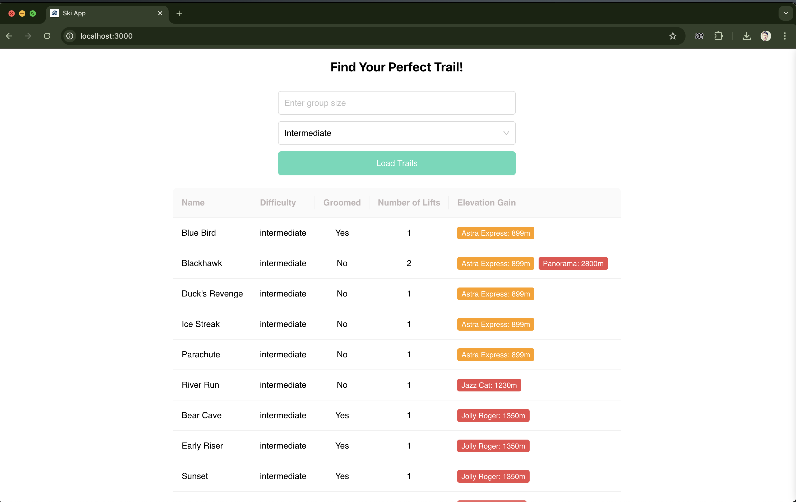
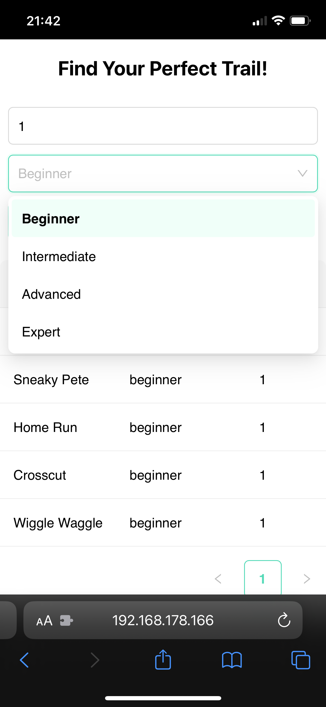
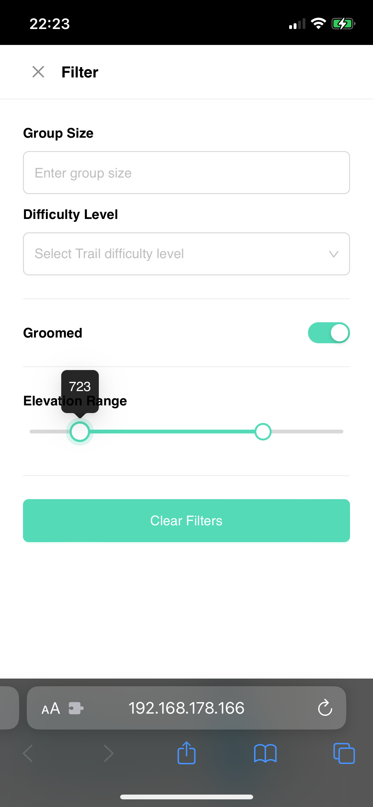
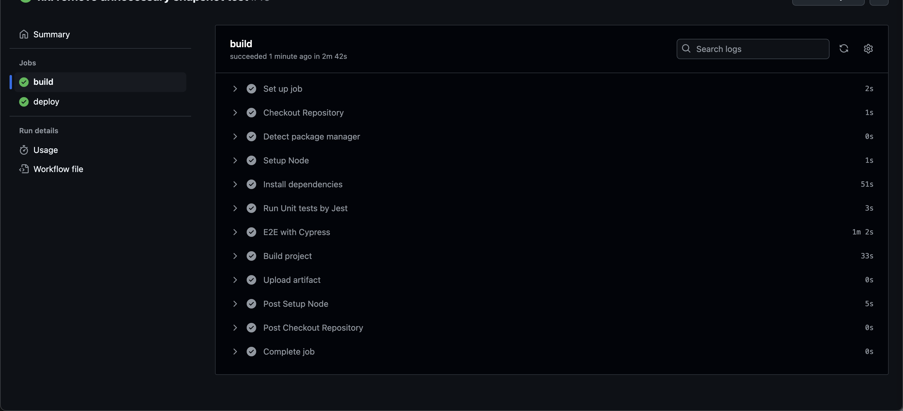

# Ski organizing manager app

## Table of Contents

- [Summary](#summary)
- [Running with Yarn](#running-with-yarn)
- [Libraries used](#libraries-used)
- [E2E Tests](#e2e-tests)
- [Unit Tests](#unit-tests)
- [CI/CD with GitHub Actions](#cicd-with-github-actions)
- [UI design ( Ant Design )](#ui-design--ant-design)

## Summary

Demo: [https://mohamad-aqajani.github.io/ski](https://mohamad-aqajani.github.io/ski)
<br>
Video: https://drive.google.com/file/d/1md4Gz3W9DggGBMLfvGwlzugMwEHTbhsZ/view?usp=sharing





<br>


## Running with Yarn

To run the project using Yarn, run the following commands:

```bash
yarn install

yarn start
```

## Libraries used

| Package    | Version |
| ---------- | ------- |
| React      | 18.3.1  |
| Typescript | 4.9.5   |
| Antd       | latest  |
| Cypress    | 13.14.1 |
| EsLint     | 8       |
| Graphql    | 16.9.0  |
| Prettier   | ~3      |

---

## E2E Tests

This project includes some e2e tests for the main flow using [**Cypress**](https://www.cypress.io/). To run the tests, follow these steps:

```bash
npx cypress run
```

For running e2e tests in chrome:

```bash
npx cypress open
```

## Unit Tests

The projects includes unit tests for filter functionalities using **Jest**

```bash
yarn test
```

The Tests are Integrated to the CI/CD pipeline and will be triggered with each push to the repository.


## CI/CD with GitHub Actions



CI/CD is implemented using **GitHub Actions** to automate the build, test, and deployment processes. With each push to the repository, the defined workflows will be triggered to ensure the code quality and deploy the application to the desired environment.

The application is hosted on _**Github pages**_ and can be accessed using the link above.


## UI design ( Ant Design )

The design is based on the [Ant Design](https://ant.design/) library. The design is simple and user-friendly.

The design system is based on the Ant design centralized theme and components. in the folder `src/theme/ThemeProvider.tsx` the theme is defined and can be customized easily.

All the reusable sizes, colors, and components are defined in the theme file and can be used across the application. it reduces CSS dripping and makes the application more consistent.
