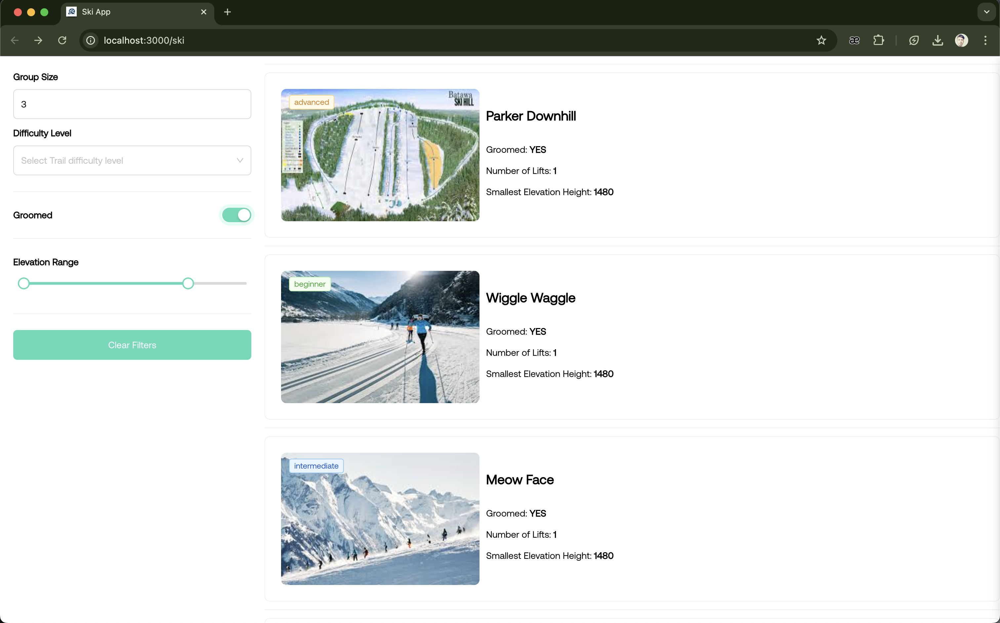
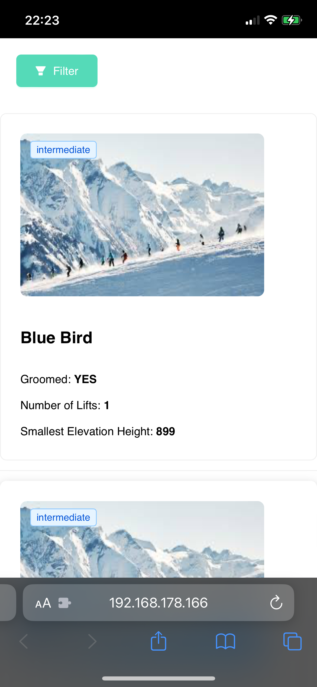

# Ski organizing manager app

## Table of Contents

-   [Summary](#summary)
-   [Running with Yarn](#running-with-yarn)
-   [Libraries used](#libraries-used)
-   [E2E Tests](#e2e-tests)
-   [CI/CD with GitHub Actions](#cicd-with-github-actions)
-   [UI design ( Ant Design )](#ui-design--ant-design)

## Summary

Demo: https://drive.google.com/file/d/15nKS4P_nWCqZCiikojUc9MmyMq9gT6ej/view?usp=sharing





<br>
In this project, we aim to load the Ski trails based on the required filters.

How it works?

-   If there is no filter applied, all the trails will be loaded.
-   The only filter in backend side is the trail status. If the status is closed, the trail will not be loaded. all the other filters are applied in front-end side.
-   Every trails row in the table has a column to show the lifts and their elevation gain.
-   To reserve a trail, click on the row of the trail. then a popup will come up to show successful reservation.


### Elevation gain tages

Lift with elevation gain lower than 500 => Safe (Green)

Lift with elevation gain between 500 and 1000 => Moderate (Orange)

Lift with elevation gain higher than 1000 => Difficult (Red)

## Running with Yarn

To run the project using Yarn, follow these steps:

1. Install the dependencies:

```bash
yarn install
```

2. Start the application:

```bash
yarn start
```

## Libraries used

| Package    | Version |
| ---------- | ------- |
| React      | 18.3.1  |
| Typescript | 4.9.5   |
| Antd       | latest  |
| Cypress    | 13.14.1 |
| EsLint     | 8       |
| Graphql    | 16.9.0  |

---

## E2E Tests

This project includes some e2e tests using [**Cypress**](https://www.cypress.io/). To run the tests, follow these steps:

```bash
npx cypress run
```

For running in chrome:

```bash
npx cypress open
```

The Tests are Integrated to the CI/CD pipeline and will be triggered with each push to the repository.


## CI/CD with GitHub Actions

CI/CD is implemented using **GitHub Actions** to automate the build, test, and deployment processes. With each push to the repository, the defined workflows will be triggered to ensure the code quality and deploy the application to the desired environment.

The application is hosted on _**Github pages**_ and can be accessed using the following link:

[https://mohamad-aqajani.github.io/ski](https://mohamad-aqajani.github.io/ski)


## UI design ( Ant Design )

The design is based on the [Ant Design](https://ant.design/) library. The design is simple and user-friendly.

In the folder **Components**, you can find the components used in the project. The components are reusable and easy to use.
